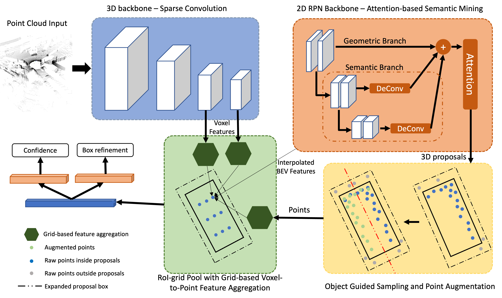

# Point Augmentation RCNN

This is a reproduced repo of 'Improving 3D Vulnerable Road User Detection with Poinnt Augmentation'

The code is mainly based on [OpenPCDet](https://github.com/open-mmlab/OpenPCDet).

## Introduction
We provide code and training configurations of PA-RCNN on the KITTI and Waymo Open dataset.  

## Overview
- [Changelog](#changelog)
- [Model Zoo](#model-zoo)
- [Installation](docs/INSTALL.md)
- [Quick Demo](docs/DEMO.md)
- [Getting Started](docs/GETTING_STARTED.md)
- [License](#license)
- [Acknowledgement](#acknowledgement)

### KITTI 3D Object Detection Baselines
Selected supported methods are shown in the below table. The results are the 3D detection performance of moderate difficulty on the *val* set of KITTI dataset.
* All models are trained with 4 NVIDIA RTX2080Ti GPUs and are available for download.
* The training time is measured with 4 NVIDIA RTX2080Ti GPUs and PyTorch 1.3.

|                                             | training time | Car@R40 | Pedestrian@R40 | Cyclist@R40  |
|---------------------------------------------|----------:|:-------:|:-------:|:-------:|
| [PA-RCNN-PV](tools/cfgs/kitti_models/pa_rcnn_pv.yaml) |~14 hours| 85.77 | 62.98 | 73.13 |

### Waymo Open Dataset Baselines
We could not provide the above pretrained models due to [Waymo Dataset License Agreement](https://waymo.com/open/terms/),
but you could easily achieve similar performance by training with the default configs.

## Installation
Please refer to [INSTALL.md](docs/INSTALL.md) for the installation of `PA-RCNN`.

## Quick Demo
Please refer to [DEMO.md](docs/DEMO.md) for a quick demo to test with a pretrained model and
visualize the predicted results on your custom data or the original KITTI data.

## Getting Started
Please refer to [GETTING_STARTED.md](docs/GETTING_STARTED.md) to learn more usage about this project.

## License
`PA-RCNN` is released under the [Apache 2.0 license](LICENSE).

## Acknowledgement
We would like to thank the authors of [`OpenPCDet`](https://github.com/open-mmlab/OpenPCDet) for their open source release of their codebase.
